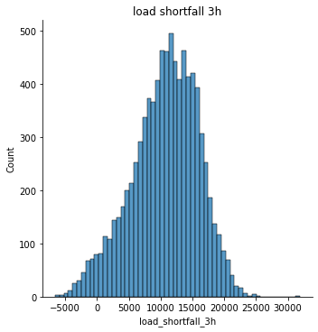
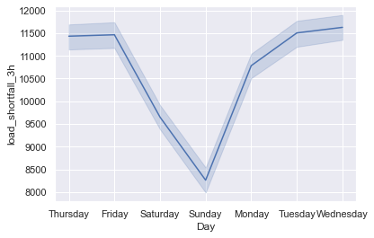
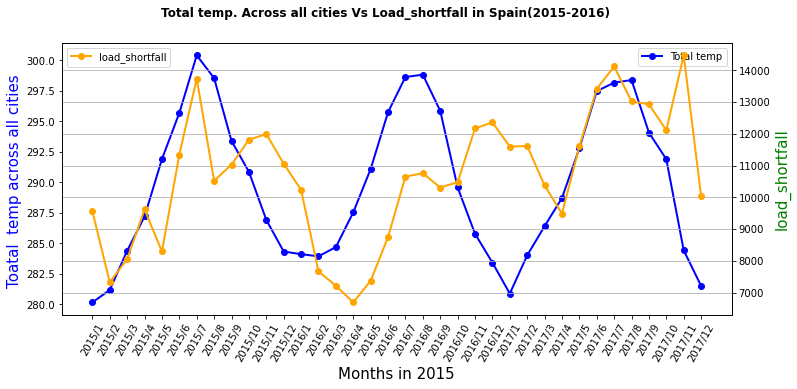

# Spain Load Shortfall Electricity Deficit
This project is modelled around providing solution and predictions on Spain's Electricity shortfall. 
## Project Summary
- Cleaned and feature engineered the dataset in order to make it in an optimal form for moel prediction 
- Performed Exploratory Data Analysis (EDA) on the data set in order to gain insight from it
- Splited the dataset in train and testset
- Trained three models (Ordinary Linear Regression, Decision Trees and Random Forest) using the trained dataset and tested how they performed on the test data set.
- Performed model optimization
- Deployed the solution using Flask
### Data SET:
This data set was taken from kaggle hwere it was provided by explore data science academy for every data science intern. it contains dataset contains information about the weather conditions in various Spanish cities for the time of 2015-2017.

The dataset contains 47 features and 1 target. The features include the time and the city-specific weather variables i.e. the wind speed in the city of Barcelona. In total there is weather data available for 5 cities but not all cities have weather information available for every weather category e.g. we might have wind speed data for Barcelona but not rainfall data whereas we have both rainfall and wind speed information for Valencia.

We have weather data for the following cities of Spain:

- Madrid
- Valencia
- Seville
- Bilbao
- Barcelona
The weather categories in the dataset include:

- wind_speed
- wind_degree
- rain_1h
- rain_3h
- humidity
- clouds_all
- pressure
- snow_3h
- weather_id
- temp_max
- temp 

### Data Cleaning:
In this stage of the project, I replaced all missing value with the mean or mode of the feature depending on the column type. \
After checking for missing values: it was discovered that
- All features was in its appropraite format
- valencia_pressure contains missing value
- this missing values where replaced with the mode of the feature
### Exploratory Data analysis:
This are some of the exploratory analysis that was carried out during the course of the project 
 \
This shows the distribution of load shortfall 3hr \
  \
This shows that spain experience more shortfall during weekend especially sunday ,it might be due to high power consumption since workers dont go to work on weekends \ 
   \
This shows how temperature affects  load shortfall in spain \
### Feature Engineering: 
- Dropped the column unnamed because it does not contain useful information
- Dropped redundant features: Feature Bilbao_temp_max and Bilbao_temp_min are dropped as they are direct reflection of the Bilbao_temp.( this applies to all temperature readings from all the regions). Additionally,Madrid_weather_id, Barcelona_weather_id,Seville_weather_id and Bilbao_weather_id are dropped because they doesn’t bring any values to the prediction.
- Creating New Features: First,we splitted 'time' faeture  to month Day of the week, Year and Hours. These new features will give us more insight since weather vary from month to month in a year.Month feature helped us determine the change in energy per season, The years feature showed a rate of change in energy supplied from renewable & fossil fuel sources,Hourly charts provided the most relevant hours of the day when load shortfalls occur.
- Encoding categorical features
used  one-hot encoding on the categorical features  to generate dummy variables
### Model Building 
For this project , three different models were used and compared against each other based on it rmse(Root Mean Square):
OLS: 4090.3
Decision Tree: 3812.74
Random Forest: 3001.09 
This showed that Random forest performed better than the other model , although its predictions stil contains lot of errors

### Model Optimization
 At this stage the project , measures were carried out to see how to optimized the model so that it can produce a better result. To achieve this grid search was carried out on the model in order to hyper- parameter tune the model to it best fitting form.
 Result : RandomForestRegressor(random_state= 42,max_depth= 10, n_estimators=  250)
 
 ### Model Deployment
 Alas!! , the project was deployed using Flask API.
 Note: Check the model.py file to view API in your locals
